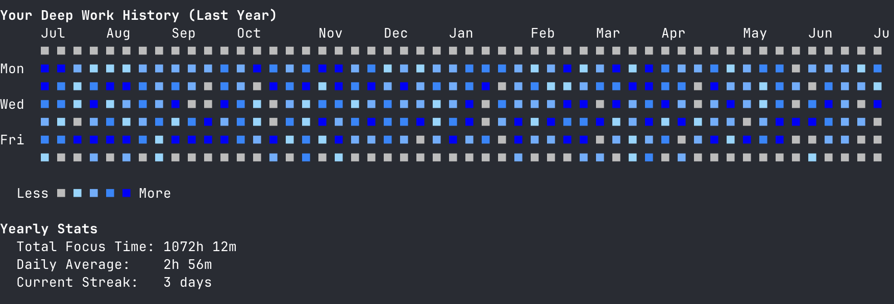

# 🌊 Flow: A Terminal-Based Tool for Deep Work

[](https://github.com/e6a5/flow/actions/workflows/ci.yml)
[](https://github.com/e6a5/flow/releases/latest)
[](https://go.dev/)
[](https://github.com/e6a5/flow/blob/main/LICENSE)

**In a world of constant distraction, your attention is a superpower. Flow is a minimalist command-line tool that helps you protect it. It's for developers, writers, and anyone who wants to build a deep work habit without leaving the terminal.**



---

## The Flow Philosophy

Flow is built on a few core principles that guide its design and purpose.

*   **Mindful Focus, Not Just Time Tracking.** Flow isn't about logging hours for a timesheet. It's about creating a ritual around deep work, helping you build the habit of single-tasking.

*   **Your Terminal is Your Sanctuary.** Deep work happens when you eliminate distractions. Flow lives in the command line, your most focused environment, preventing the context-switching required by GUI apps.

*   **Your Data is Yours. Period.** Flow is private by default. It works offline, requires no account, and stores all your data in simple, local text files. You have complete control.

*   **Compose Your Perfect Workflow.** Flow embraces the Unix philosophy. It's a simple, powerful tool that can be scripted and combined with others. Use its hooks to integrate with your existing setup.

---

## Quick Start

1. **Install Flow**:
   ```bash
   curl -sSL https://raw.githubusercontent.com/e6a5/flow/main/install.sh | bash
   ```

2. **Start your first session**:
   ```bash
   flow start --tag "My first deep work session"
   ```

3. **Check your progress**:
   ```bash
   flow status
   ```

4. **End when complete**:
   ```bash
   flow end
   ```

---

## A Typical Workflow

Flow is designed to be intuitive. Here's how a typical session works:

1.  **Start a session** when you're ready to focus. Give it a tag and a target duration.

    ```bash
    flow start --tag "Writing the first draft" --target 2h
    ```

2.  **Check your status** at any time to see your progress.

    ```bash
    flow status
    > 🌊 Deep work: Writing the first draft (Active for 45m) / 2h 0m (1h 15m remaining)
    ```

3.  **End the session** when the work is complete. Your focus time is automatically logged.

    ```bash
    flow end
    > ✨ Session complete: Writing the first draft
    > Total focus time: 2h 5m
    ```

4. **Review your day** and find your patterns.
   ```bash
   flow recent
   flow insights
   ```

5. **Clean up if needed** - Remove any test sessions or mistakes.
   ```bash
   flow delete
   ```

---

## Installation

```bash
curl -sSL https://raw.githubusercontent.com/e6a5/flow/main/install.sh | bash
```

_The installer will add the `flow` binary to `/usr/local/bin` and check for necessary dependencies._

For other installation methods (Go, manual), see the [Installation Guide](docs/INSTALL.md).

## Full Command Reference

### Core Session Commands

| Command                     | Description                                    |
| --------------------------- | ---------------------------------------------- |
| `start [--tag ""][--target ""]` | Begin a deep work session with an optional target duration. |
| `status [--raw]`            | Check the current session status.              |
| `pause`                     | Pause the active session.                      |
| `resume`                    | Resume a paused session.                       |
| `end`                       | Complete the session and log it.               |
| `delete`                    | Interactively delete a session from your log.  |
| `watch`                     | Run a watcher to get gentle, timely reminders. |

> **💡 Tip**: After ending a session, if you made a mistake, you can immediately run `flow delete` to remove it!

### Data & Analysis Commands

| Command          | Description                                                             |
| ---------------- | ----------------------------------------------------------------------- |
| `log [flags]`    | View completed session history. See `flow log --help` for flags.        |
| `recent`         | Show a summary of today's completed sessions.                           |
| `dashboard`      | Show a yearly contribution graph of your focus sessions.                |
| `insights`       | Analyze your work history to see patterns like your busiest day.        |
| `export [flags]` | Export session data to CSV or JSON. See `flow export --help` for flags. |

### Utility Commands

| Command                  | Description                                            |
| ------------------------ | ------------------------------------------------------ |
| `goal [--set ""]`        | Set or view your daily focus goal.                     |
| `doctor`                 | Run a diagnostic check on your Flow setup.             |
| `completion [bash\|zsh]` | Generate shell completion scripts.                     |

## Customization

You can extend Flow to fit your unique workflow using hooks and environment variables.

- **Automation Hooks**: Trigger custom scripts on session events.
- **Watcher Timings**: Customize reminder intervals for the `watch` command.
- **Configuration**: Customize storage paths using environment variables.

For detailed information, see the [Customization Guide](docs/CUSTOMIZATION.md).

## Contributing

Flow is built for the community, and we welcome contributions! Whether it's a bug report, a feature request, or a pull request, we'd love to hear from you. Please see our [Contributing Guidelines](CONTRIBUTING.md) to get started.

## License

Flow is open-source software licensed under the [MIT License](LICENSE).

---

_One thing at a time. Runs offline. Powered by presence._
